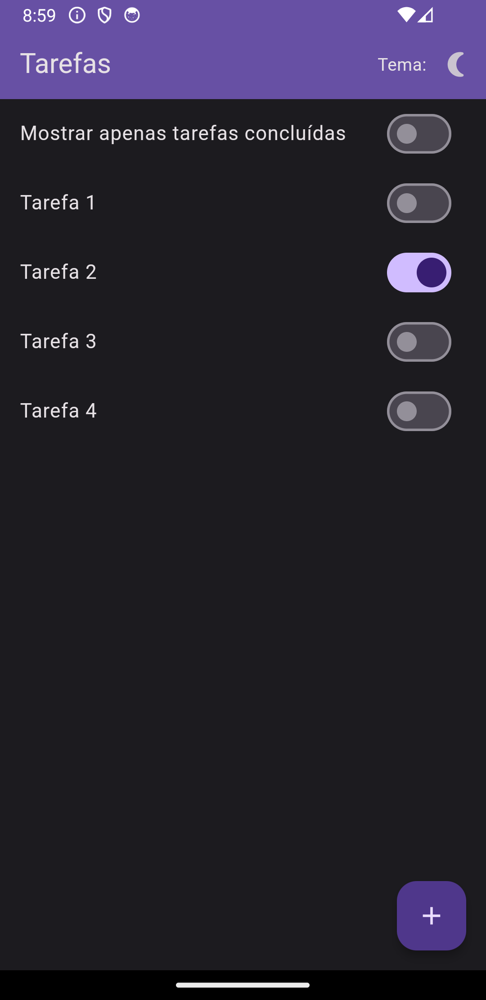
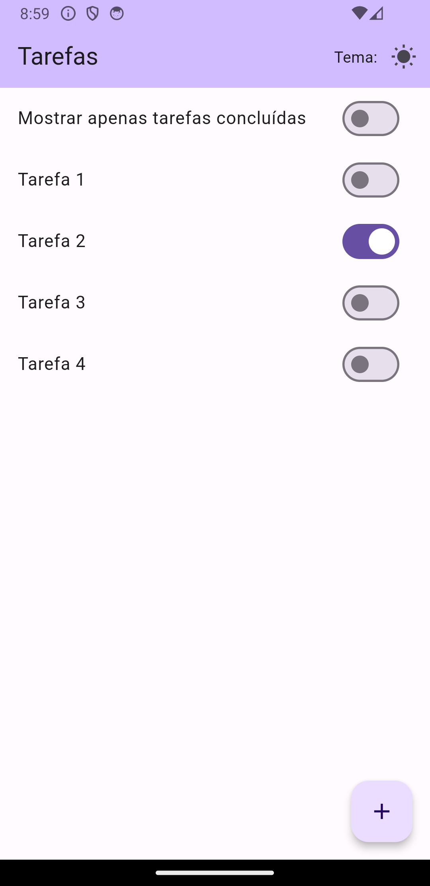
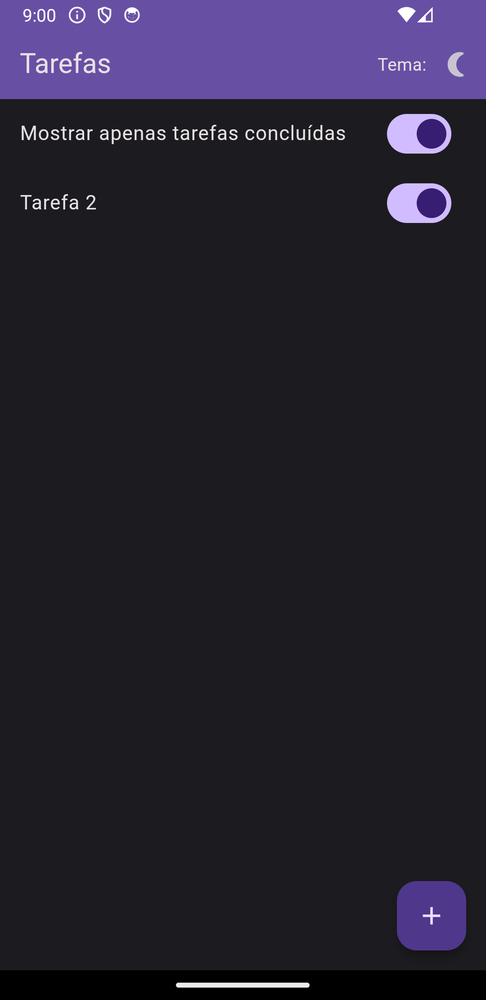
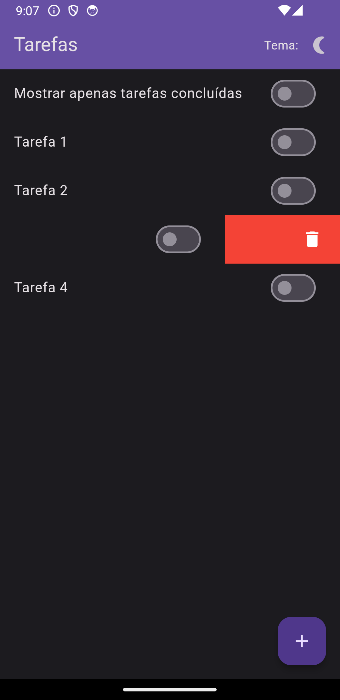
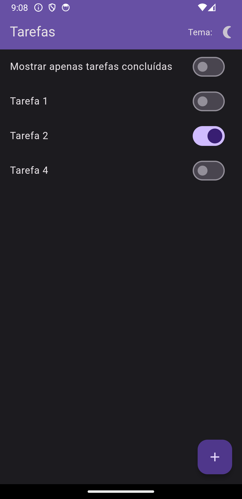
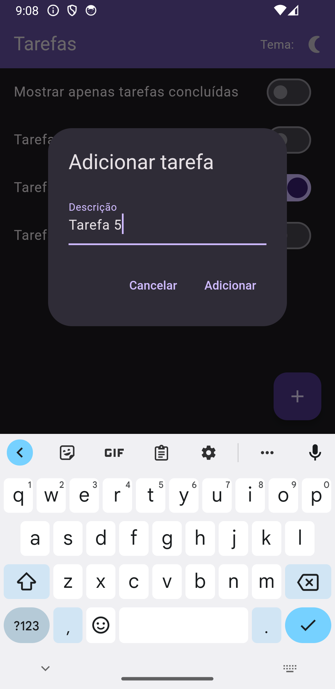

# App Lista de Tarefas com Flutter e ( MobX ou Provider )
Este é um aplicativo de lista de tarefas construído com Flutter e MobX. Ele permite que os usuários adicionem tarefas, marquem-nas como concluídas e removam tarefas arrastando-as para o lado. Além disso, os usuários podem optar por visualizar apenas as tarefas concluídas.

### Recursos
- Adicionar novas tarefas
- Marcar tarefas como concluídas
- Remover tarefas arrastando-as para o lado
- Opção para visualizar apenas tarefas concluídas
- Suporte para alternar entre temas claro e escuro

### Screenshots
<p float="left">
  
   
   
   
   
   
</p>

### Como usar
Para adicionar uma nova tarefa, clique no botão flutuante com o ícone de adição. Uma caixa de diálogo será aberta, onde você pode inserir a descrição da tarefa e confirmar a adição.

Para marcar uma tarefa como concluída, use o switch ao lado de cada tarefa na lista.

Para remover uma tarefa, arraste-a para o lado.

Para visualizar apenas as tarefas concluídas, use o switch no topo da lista de tarefas.

Para alternar entre o tema claro e escuro, clique no ícone de sol ou lua na barra de aplicativos.

### Instalação
Para instalar e executar este aplicativo, você precisará ter o Flutter e o Dart configurados em seu ambiente. Depois de ter essas dependências instaladas, você pode baixar ou clonar este repositório e executar flutter run no diretório raiz do projeto.

- Baixe as dependencias `flutter pub get``
- Rode a aplicação `flutter run`

- Para alterar o modo Provider / Mobx basta ajustar em `lib/main.dart`
  - Para Mobx
  ```
  import 'home_mobx.dart';
  void main() {
    runApp(const MyAppMobx());
    }
  ```
  Obs: Para Mobx sempre que tiver alguma modificação nas variaveis de model Tarefa e ListaTarefas utilize o comando abaixo para atualizar os arquivos g:
  `flutter packages pub run build_runner build `

  - Para Provider
  ```
  import 'home_provider.dart';
  void main() {
    runApp(const MyAppProvider());
    }
  ```

### Contribuição
Contribuições são bem-vindas! Se você encontrar um bug ou gostaria de adicionar uma nova funcionalidade, sinta-se à vontade para criar um issue ou um pull request.
